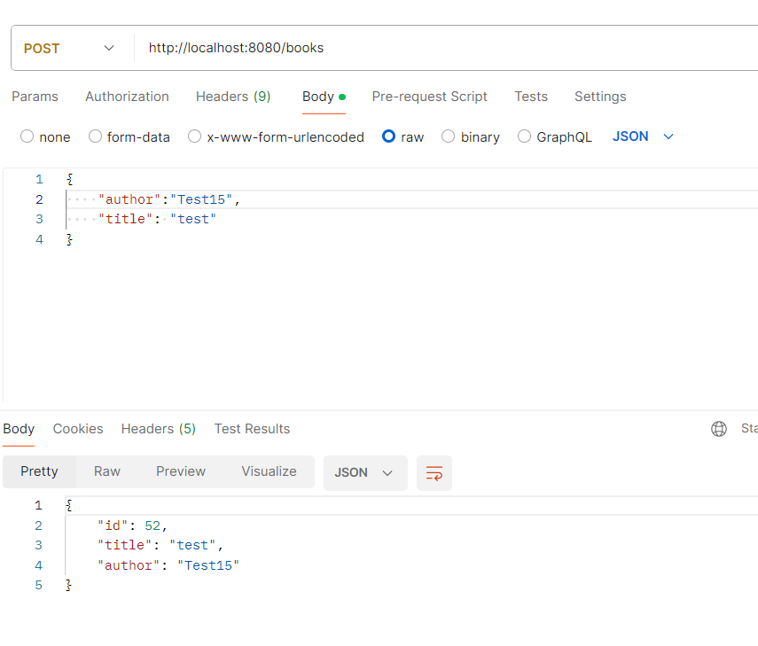
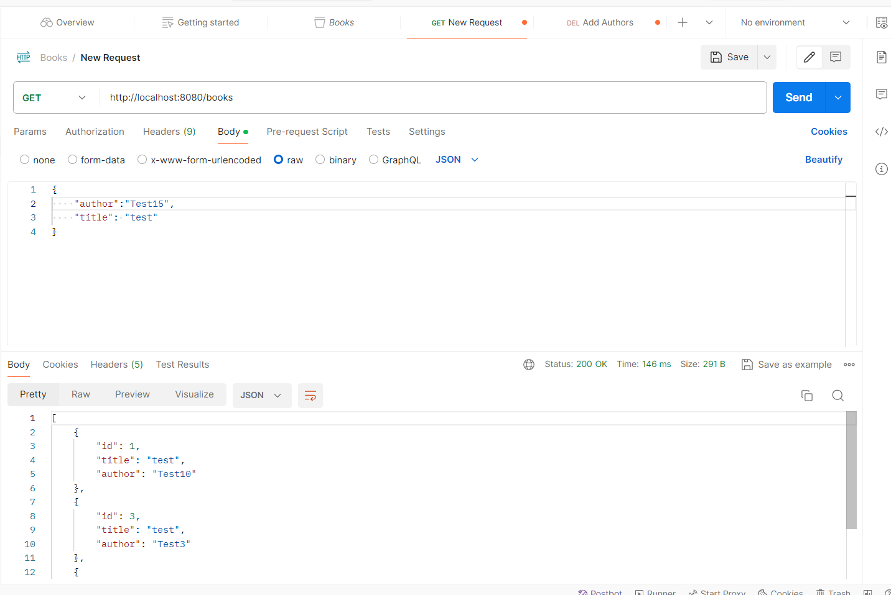
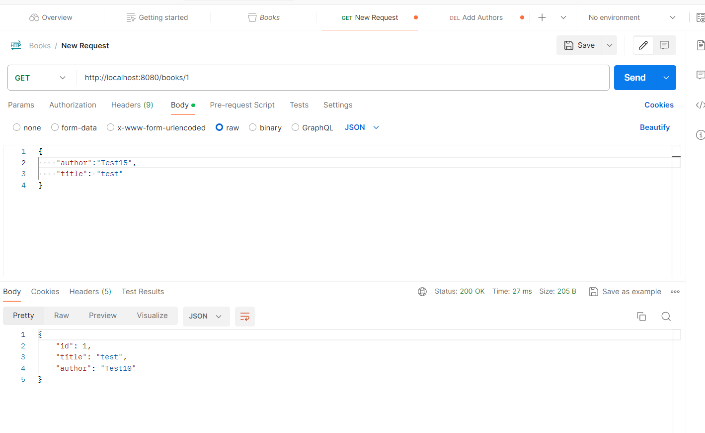
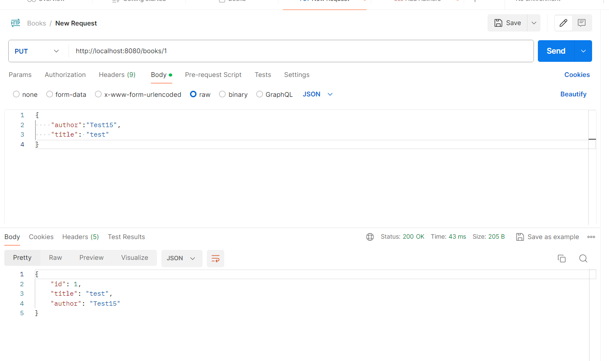
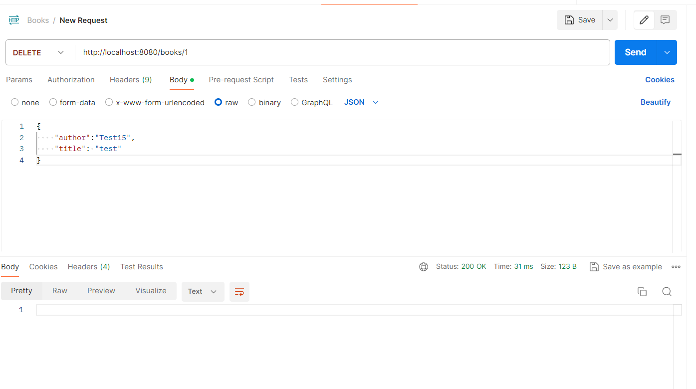

## Library Application

1. Create a SpringBoot application using SpringInitializr with Maven build tool
2. Added MySql Driver dependency and other dependencies suggested by IntelliJ
3. Installed MySql and MySql Workbench
4. Created a new database connection 
5. Updated application.yml with the database configurations
6. Created the Rest Endpoints (Book Entity,Book Controller,BookRepository)
7. Run the application
8. Tested the endpoints in Postman

#### Post  /books

#### Get  /books

#### Get  /books/1

#### Put  /books/1

#### Delete  /books/1

